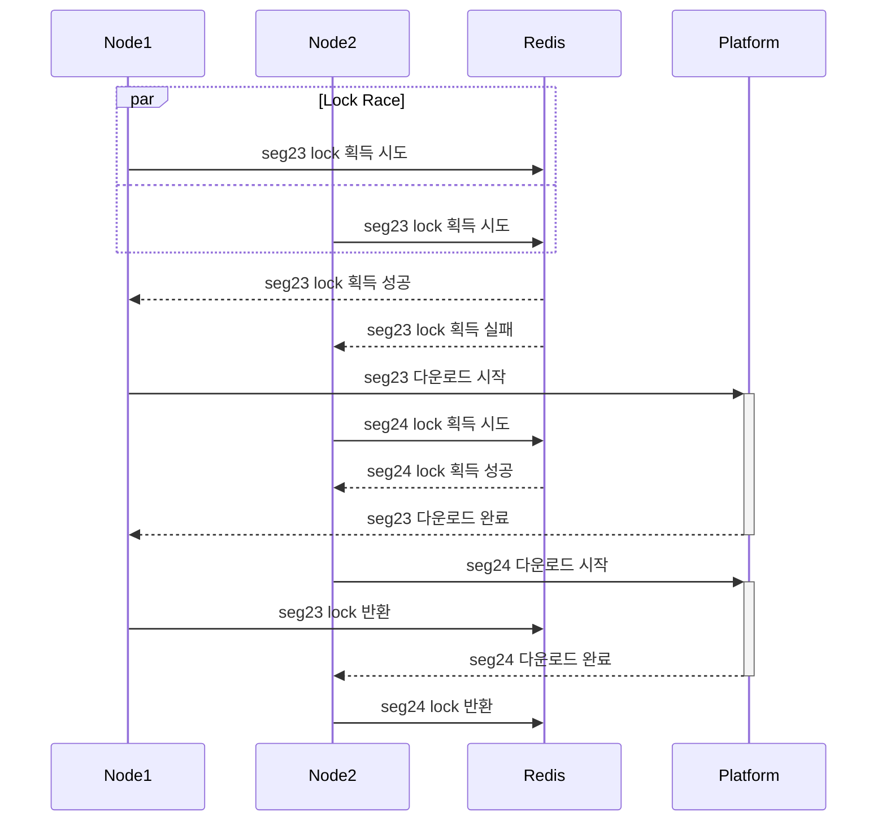

# recnode

Distributed Live Stream Recording Cluster

## Global Lock

```mermaid
sequenceDiagram
    participant N1 as Node1
    participant N2 as Node2
    participant R as Redis
    participant P as Platform

    par Lock Race
        N1->>R: seg23 lock 획득 시도
    and
        N2->>R: seg23 lock 획득 시도
    end
    
    R-->>N1: seg23 lock 획득 성공
    R-->>N2: seg23 lock 획득 실패


    N1->>+P: seg23 다운로드 시작

    N2->>R: seg24 lock 획득 시도
    R-->>N2: seg24 lock 획득 성공

    P-->>-N1: seg23 다운로드 완료

    N2->>+P: seg24 다운로드 시작

    N1->>R: seg23 lock 반환

    P-->>-N2: seg24 다운로드 완료

    N2->>R: seg24 lock 반환
```

## Parallel Lock (Semaphore)

## Prometheus Dashboard Support

