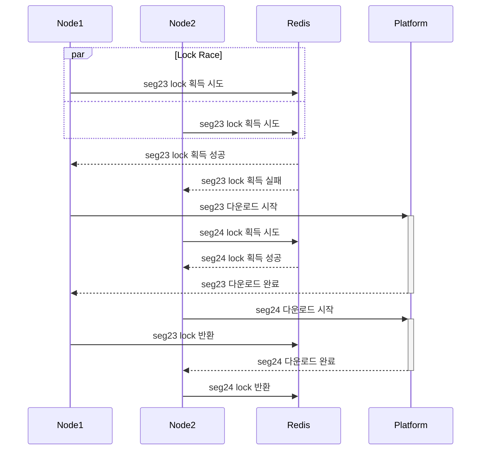

# recnode

Distributed Live Stream Recording Cluster

## Global Lock Strategy

별도의 제어 장치가 없다면 모든 노드가 동일한 세그먼트를 동시에 요청하게 되고, 이는 불필요한 중복 트래픽 발생으로 이어집니다. 이러한 비효율을 방지하기 위해 Redis로 구현된 Global Lock을 사용합니다.

시스템은 네트워크 대역폭 효율성과 데이터 가용성을 동시에 확보하기 위해, 상황에 따라 두 가지 락 전략을 유동적으로 운용합니다.

### 1. First Request: Mutex

최초의 세그먼트 요청에 한해서는 Mutex를 적용합니다. 이를 통해 요청을 순차적으로 처리함으로써 네트워크 효율성을 보장합니다.

아래 시퀀스 다이어그램과 같이, 노드들은 세그먼트 다운로드 전 락 획득 경쟁(Lock Race)을 수행합니다. 락 획득에 실패했다해도 대기하지 않으며, 즉시 다음 세그먼트 처리를 시도합니다.

### 2. Failure Recovery: Semaphore

특정 세그먼트 다운로드에 실패했을 경우, 세그먼트 유예 기간 내에 데이터를 확보하는 것이 최우선입니다. 이를 위해 실패한 건에 대해서는 병렬 요청을 허용하여 성공 확률을 높입니다.

단, 무제한적인 병렬 요청은 네트워크 과부하를 유발할 수 있으므로, Semaphore를 통해 동시 재시도 요청 수를 제한적으로 제어하여 시스템 안정성을 유지합니다.

## Prometheus Dashboard Support

