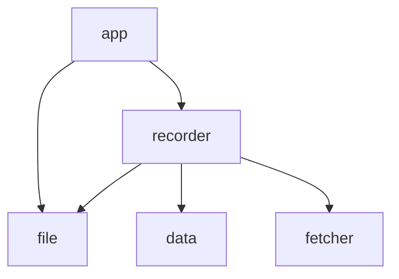

# stdl

live **st**ream **d**own**l**oader

## modules

- entry point
    - `app`
- main modules
    - `recorder`
- sub modules
    - `data`: live data 기록, segment lock 처리, 실패 segment 처리
    - `fetcher`: 플랫폼 별 live data fetching을 위한 http client
    - `file`: 범용 파일 액세스 처리 (local, s3...)
- common: 모든 모듈이 의존할 수 있는 모듈
    - `utils`: 아무 모듈도 의존하지 않는 범용 모듈
    - `common`: `utils` 모듈만을 의존하는 범용 모듈

### dependency

